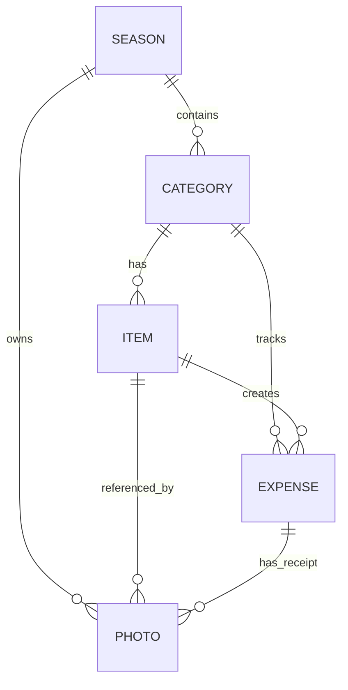

# 🧧 Săn Sale Tết - Hệ Thống Quản Lý Mua Sắm Thông Minh

Ứng dụng giúp người dùng lập kế hoạch, theo dõi chi tiêu và quản lý tài chính hiệu quả trong dịp Tết Nguyên Đán với các tính năng phân tích thông minh và lưu trữ hình ảnh lịch sử.

## 🚀 Tính Năng Cốt Lõi (Business Logic)

### 1. Quản Lý Ngân Sách Thông Minh (Smart Budgeting)
- **Hệ thống Phân tích Độ lệch (Variance Analysis):** So sánh tổng ngân sách được cấp (`planned_budget`) với tổng giá trị giỏ hàng mong muốn (`target_price * quantity`) để dự báo tình hình tài chính trước khi mua.
- **Cảnh Báo Sức Khỏe Tài Chính (Financial Health):**
  - 🟢 **Healthy:** Kế hoạch chi tiêu nằm trong ngân sách.
  - 🟡 **Danger:** Tổng giá trị giỏ hàng vượt ngân sách dự kiến.
  - 🔴 **Critical:** Số tiền thực tế đã chi vượt quá ngân sách cho phép.
- **Smart Suggestions:** Tự động đưa ra các gợi ý tối ưu hóa (ví dụ: cắt giảm các món không thiết yếu) khi ngân sách rơi vào tình trạng Danger/Critical.

### 2. Quản Lý Media & Hóa Đơn (Integrated Media)
- **Hệ thống Receipt & Product Gallery:** Lưu trữ tập trung toàn bộ hình ảnh liên quan đến kỳ Tết (Hóa đơn và Ảnh sản phẩm).
- **Liên kết ngữ cảnh (Contextual Binding):** Ảnh được gắn trực tiếp vào từng món đồ (để nhớ mẫu sản phẩm) hoặc từng giao dịch chi tiêu (để đối chiếu hóa đơn).

### 3. Trí Tuệ Lịch Sư (Historical Intelligence)
- **So sánh đa mùa (Multi-season Comparison):** Tự động tìm kiếm và hiển thị dữ liệu lịch sử của món đồ dựa trên tên trong các năm cũ.
- **Nhận diện giá & ảnh:** Giúp người dùng biết chính xác năm ngoái mình mua món đó ở đâu, giá bao nhiêu để không bị mua đắt trong năm nay.

---

## 🛠 Kiến Trúc Kỹ Thuật (Tech Stack)

| Thành phần | Công nghệ sử dụng | Ý nghĩa |
|---|---|---|
| **Framework** | Flutter | Xây dựng giao diện mượt mà trên đa nền tảng |
| **State Management** | Provider | Quản lý luồng dữ liệu và trạng thái ứng dụng |
| **Database** | SQLite (sqflite) | Lưu trữ offline-first, hỗ trợ migration (V4) |
| **Storage** | Path Provider | Quản lý lưu trữ file ảnh nội bộ |
| **Tools** | Image Picker | Tích hợp camera và thư viện ảnh |

### Sơ đồ quan hệ dữ liệu (Data Relationship)

---

## 📂 Cấu Trúc Thư Mục Quan Trọng

- `lib/data/models/`: Định nghĩa các thực thể dữ liệu (`Item`, `Category`, `Season`, `Photo`, `Expense`).
- `lib/data/repos/`: Lớp truy xuất dữ liệu từ SQLite (Repository Pattern).
- `lib/viewmodels/`: Xử lý logic nghiệp vụ và cập nhật trạng thái UI.
- `lib/views/screens/`: Giao diện người dùng (Dashboard, Shopping, Media, Comparison).

---

## ⚙️ Hướng Dẫn Kỹ Thuật

- **Nâng cấp Database:** Nếu bạn thêm trường mới, hãy tăng `DATABASE_VERSION` trong `app_database.dart` và cập nhật logic trong `_onUpgrade`.
- **Thêm tính năng mới:** Tuân thủ luồng: `Model` -> `Repo` -> `ViewModel` -> `Screen`.
- **Chạy ứng dụng:** `flutter run`.

---
*Tài liệu được cập nhật dựa trên phiên bản nâng cấp Logic nâng cao 2026.*
